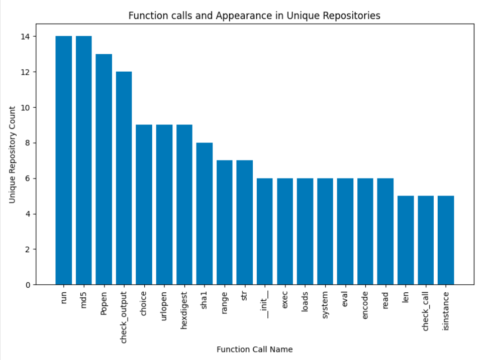
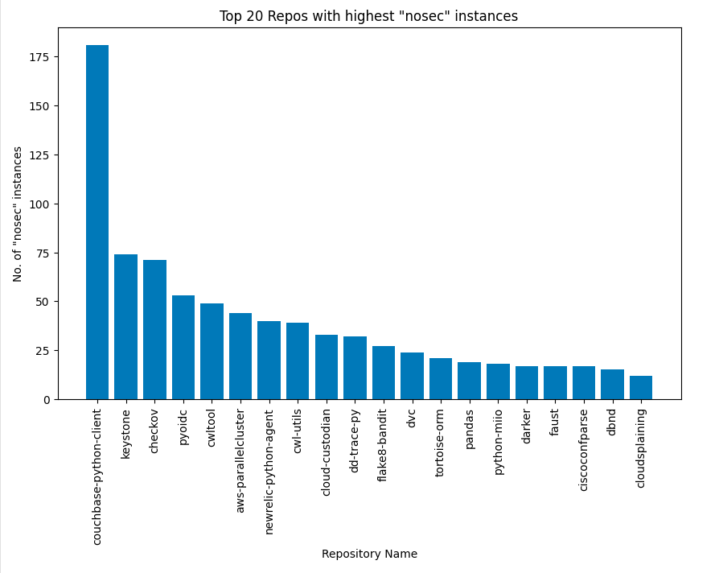

# Progress report
Current progress is broken down into following 
1. Scrape top downloaded PyPi repos and understand their bandit usage
2. Analyze bandit exceptions to identify the areas to focus
3. Understand plugins available out of the box
4. Take a sample repo and understand how it consumes bandit

## Looking for bandit usage in top PyPi repos
[This](../code/analysis/pypi_list.ipynb) notebook contains work on getting top PyPi packages making use of bandit.
1. We made use of top 8000 PyPi repos published.
   1. Existing work: [Top PyPi Packages](https://hugovk.github.io/top-pypi-packages/)
2. Identified the GitHub repos for the filtered list, using PyPi package page
   1. This was done by scraping the PyPi package page (eg: [boto3](https://pypi.org/project/boto3/)) and looking for GitHub repo URLs using webpage scraping.
3. Then we used GitHub v3 search APIs to filter for the repos that made use of `bandit`. 
   1. Filter used: `bandit+in:file+repo:REPO-NAME`
   2. Here `REPO-NAME` is replaced with full name of the repo. Eg: `bandit+in:file+repo:boto/boto3`
4. This narrowed a list of 282 repos which were then cloned locally.
5. Filtered for the list of `nosec` usage in .py files using `ripgrep`
   1. CMD: `rg "nosec" -n -g "*.py" ./repos_pypi 2>&1 | tee nosec_logs.txt`

## Analyzing usage of bandit exceptions
[This](../code/analysis/Analysis_of_Nosec_Mentions.ipynb) notebook contains the work on analyzing the `nosec` usage in the repos narrow down in the previous step.
1. Performed text analysis on the `nosec_logs.txt` file generated in the previous steps.
2. Grouped the result into various classes based on the type of nosec usage.
   1. Top functions that had nosec usage: `eval`, `fromstring`, `isinstance`, `sha1`
   2. Packages that functions belonged to: `subprocess`, `pickle`, `xml`
   3. Futher details are available in the notebook.
3. Further performed analysis across packages to identify commonly used exceptions across packages.
   1. Following were most common functions across packages: `run`, `md5`, `Popen` etc

This work helps in narrowing the focus for our further analysis in identifying vulnerabilities. The outcomes are listed under _Key Observations_ section below.

## Understanding bandit plugins
[This](bandit_plugins.md) document summarizes available plugins and its properties. This work acts as a reference in our future analysis, to validate the usage of exceptions as well as identifying bad coding practices.

## Understanding the consumption on bandit in a sample repo
!!! TODO

# Key Observations
### 3.5 % of top 8000 pypi repos use bandit
### 57.4% of the repos that used bandit contained atleast one `nosec` usage
### Distribution of functions which to which exceptions were added (`nosec`) frequently across repositories

Here we see a list of unsafe (unless used with caution) functions. This suggests existence of vulnerabilities.

### Distribution of number of exceptions per repository

Here we see, the nosec is not used cautiously which suggests developer ignorance, and opens up possibility of bugs.

### Only 7.34% of the `nosec` exception has the category mentioned in it
This also suggests usage of exceptions is not carefully added

# Next Steps
1. Manually analyze the `nosec` usages which are common across packages.
2. Automate the procecss of vulnarability discovery based on previous step
3. Analyze issues to achive exploitation and report to the package owners.